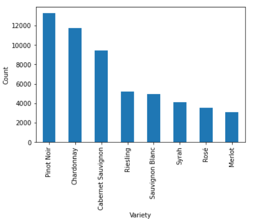
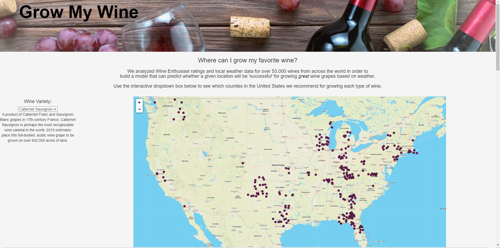

# growmywine

# Green Team Final Project

### Team members:
- [Renata Barbalat](https://github.com/renatabg2205)
- [Andrew Carr](https://github.com/davidandcarr)
- [Sam Cicciari](https://github.com/secicciari)
- [Katie Fell](https://github.com/katief01)

## Project overview
### Topic
Where can you grow great wines in the US - based on Wine Enthusiast reviews and weather data. 

#### Reason for topic
We're sick of COVID data and wanted to analyze something a little more fun! We're excited for individuals to use our app to determine whether they should start a winery in their area.

### Questions we hope to answer
- What combination(s) of weather features (temperature, air pressure, precipitation, humidity) will lead to the best wines by variety (according to Wine Enthusiast ratings)?
- Which areas are best for growing each type of wine?

### Presentation
[Google slides presentation](Presentation/GrowMyWine.pdf)

### Data sources
* Wine Enthusiast wine review data: https://www.kaggle.com/zynicide/wine-reviews
* Weather data from Open Weather's Statistical Weather Data API
* Location data from Google Maps Places API

### Tools & Technologies
- Data cleaning/exploration: Python, Pandas
- Data storage: Posgres, AWS
- Machine learning: Random Forest Classifier via SciKitLearn
- Dashboard: Heroku, Leaflet, HTML

## Project Outline
### Data Exploration
Our data exploration is documented in winesweeper.ipynb (Resources/cleaning_notebooks).
- We dropped all of the columns that will not be used in our analysis (such as wine description, taster name).
- We checked the number of unique values in our most important columns - variety, points, and country.
- We narrowed down the 12 wine varietals that have the most entries in our dataset. Of those 12, we chose to focus on the top 8 single-grape varietals (i.e., no “blends”) - Pinot Noir, Chardonnay, Cabernet Sauvignon, Riesling, Sauvignon Blanc, Syrah, Rosé, and Merlot. Update as of 5/22: we decided to remove Rosé from our list because Rosé isn't actually a specific type of grape.

- In order to get the weather data we needed, we had to find a way to identify latitudes and longitudes for each winery. Using our narrowed down dataset, we created a "winery_search" column by combining the winery name, the word "winery", and the country. We confirmed the number of unique wineries in our list (8,701) and used the unique search terms to get the geocoordinates for each winery from the Google Maps Places API. 

### Machine Learning
#### Preprocessing
- Confirmed datatypes in each column
- Merged the winery weather data with the wine reviews data
- Confirmed the unique scores and unique varieties to ensure that this final dataset has all the information we need

#### Feature Engineering & Selection
- We selected average temperature, average air pressure, average humidity, and average precipitation as our features. We're intersted in exploring how weather impacts wine quality and after researching the grape growing process, we identified temperature, humidity, and precipitation as some of the most important factors. We are also interested in air pressure because grapes grow differently at different elevations. If we had additional time and resources, we would explore a wider variety of weather features and would pull more specific weather data for each location. For example, we would look at monthly or seasonal averages instead of yearly averages.
- We are considering a score of 90 and above a "great" wine, in this case. Our target is whether the given combination of weather features will create a great wine or will not (binary classification).

#### Training & Testing Sets
To create our training and testing data sets, we used SciKitLearn's train_test_split module on our starting dataset that includes wine review data for the top 8 varietals we identified as well as the weather (average temperature, average air pressure, average precipitation, and average humidity) for each winery. 

#### Model Choice
We will be using Random Forest Classifier, and we will be creating separate models for each of our 8 main wine varietals.
    - In our machine learning exploration phase, we chose to look at logistic regression as well as ensemble learning models including Random Forest Classifier and Decision Tree Classifier to determine how accurate these models are on our datasets. Ultimately, Random Forest Classifier resulted in the the best accuracy.
    -  This model will take the ideal weather features (temperature, air pressure, precipitation, humidity) and determine if "Yes" the area meets ideal weather conditions for creating a great wine in this area, or "No", the area does not meet this criteria, for each varietal.
    - All 8 of our models have an accuracy > 77%, and our mean accuracy is 82%.

### Data Analysis
We analyzed the weather data for all the counties in the United States by putting it through each of our machine learning models to determine whether that county would or would not be a recommended place to grow each wine varietal.

### Project Database
For our database we are using Postgres SQL hosted in AWS RDS. Our database will take in the output from our data exploration phase (cleaned up wine reviews file and winery weather data) and merge the data sets. The merged data will then be fed directly into our machine learning model. We will also use our database to hold the output from our model. The output will indicate whether each US county will or will not create great wine for each varietal, based on the average weather data.

### Website
[Link to our website](https://growmywine.herokuapp.com/)

#### Interactive Elements
- Users can select the type of wine they're interested in from a drop down and the map will update to indicate areas where that wine grows well.
